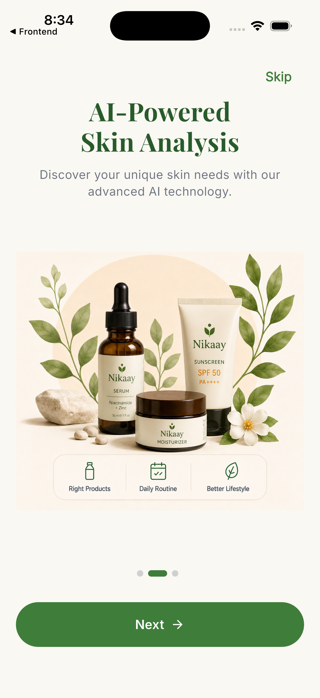
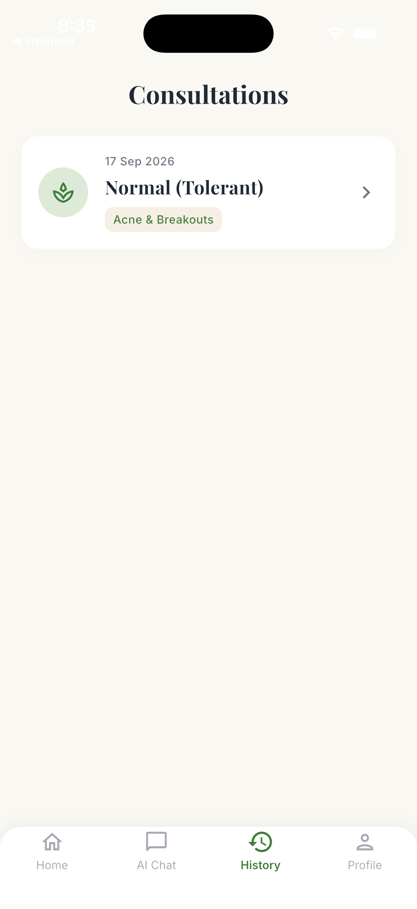
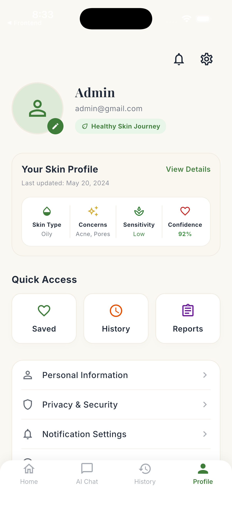
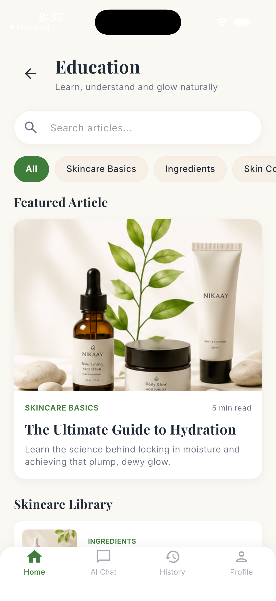
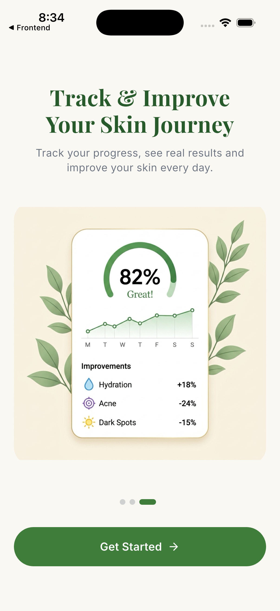
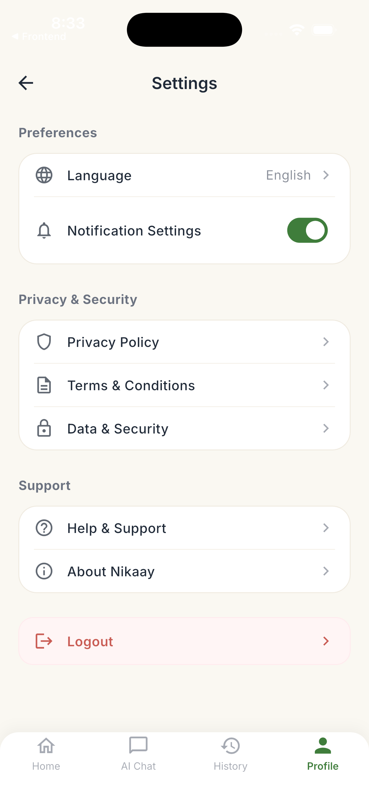
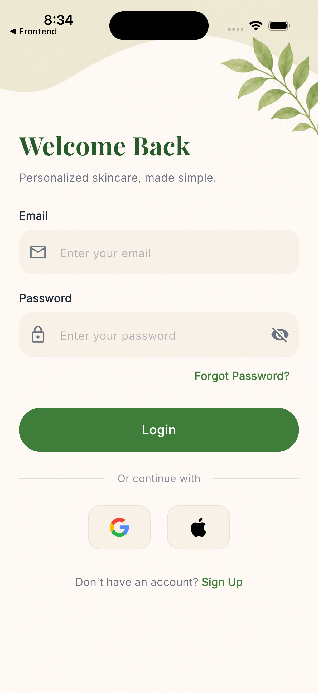
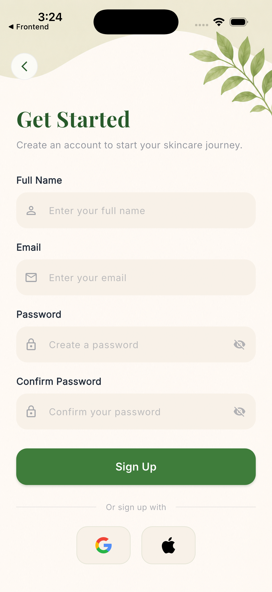
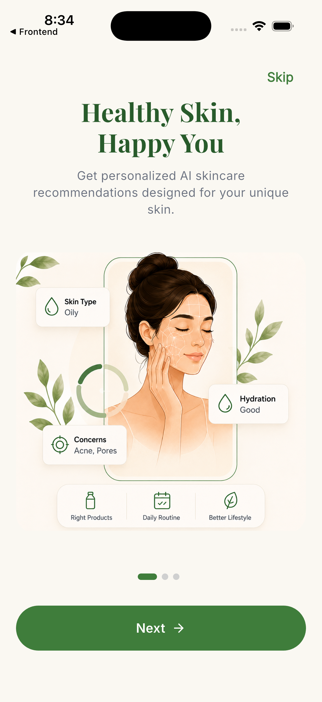

# Nikaay

<p align="center">
  
  
  
  
  
  
</p>

<p align="center">
  <b>A production-architected, AI-powered organic skincare consultation platform.</b><br/>
  <i>Flutter frontend, Django REST backend, Gemini-driven skin analysis built with the resilience patterns of a real product, not a portfolio demo.</i>
</p>

## Table of Contents

- [Demo](#demo)
- [Screenshots](#screenshots)
- [Key Features](#key-features)
- [Tech Stack](#tech-stack)
- [Engineering and Production Considerations](#engineering-and-production-considerations)
- [Local Setup Instructions](#local-setup-instructions)
- [Security Notes](#security-notes)
- [Future Improvements](#future-improvements)

---

## Demo

A quick look at the splash screen and onboarding flow, captured directly from the app.

<br/>

<p align="center">
  
  
</p>

<br/>


---

## Screenshots

<p align="center">
  
  
  
  
</p>
<p align="center">
  
  
  
  
</p>
<p align="center">
  
  
  
</p>

---

## System Architecture & Design

To demonstrate production-readiness, Nikaay is built using several core system design principles:

- **Client-Server Architecture:** The Flutter frontend and Django backend are completely decoupled, communicating purely via stateless REST APIs.

- **Feature-First Architecture (Frontend):** UI, domain models, and data repositories are grouped by feature (e.g., `auth`, `assessment`), making the codebase highly modular and scalable.

- **Delegated Authentication:** Firebase securely manages credentials and tokens, which are then passed to Django for validation. This offloads identity risks to Google's infrastructure.

- **Graceful Degradation:** If the third-party Gemini API fails or times out, the backend gracefully falls back to a curated offline dataset instead of crashing the client.

- **API Boundary Protection:** Strict rate-limiting (throttling) is applied to the AI endpoints to prevent abusive traffic and unbounded inference costs.

- **Defensive Parsing:** Server-side schema validation and regex-based parsing ensure that probabilistic LLM outputs never crash the mobile app with malformed JSON.

---

## Engineering and Production Considerations

Nikaay is architected with production resilience and cost-awareness in mind, rather than as a bare-minimum demo:

- **API-Level Throttling** — Protects against runaway AI service costs from repeated or abusive requests using DRF's `ScopedRateThrottle`.
- **Graceful Degradation** — Falls back to curated skincare data if the AI service fails, with structured logging for observability into when and why fallbacks occur.
- **Defensive LLM Parsing** — Uses pattern-based regex extraction rather than naive string splitting, to handle variability in LLM-generated JSON output.
- **Strict Schema Validation** — Server-side schema validation ensures the mobile app never receives malformed AI responses, catching errors at the API boundary instead of the client.
- **Cross-Platform Network Client** — Built without top-level `dart:io` dependencies, enabling the same networking code to compile for Flutter Web alongside iOS and Android.
- **Transparent AI Telemetry** — Explicit fallback flags (`is_fallback`) ensure degraded or offline responses are tracked in the database for auditing, so it's always clear which recommendations came from the model versus the fallback dataset.

---

## Tech Stack

### Frontend (Mobile App)

| Layer | Technology |
|---|---|
| Framework | Flutter / Dart |
| State Management | Riverpod |
| Navigation | GoRouter |
| Networking | Dio, with interceptors for auth tokens |
| Storage | Shared Preferences |

### Backend (API Server)

| Layer | Technology |
|---|---|
| Framework | Django and Django REST Framework (DRF) |
| Database | PostgreSQL |
| AI Integration | Google Gemini API |
| Authentication | Firebase Admin SDK (ID Token Verification) |

---

## Key Features

**Personalized AI Skin Analysis**
Users complete a comprehensive multi-step assessment, which is processed by Google's Gemini LLM to generate custom morning and evening routines along with ingredient recommendations tailored to their skin profile.

**Intelligent Skincare Chatbot**
A real-time AI assistant that answers skincare questions with contextual awareness of the user's prior assessments and stated concerns.

**Secure Authentication**
Firebase Authentication (Email/Password) is used on the client and verified server-side via the Firebase Admin SDK, keeping session handling and identity checks in sync between the app and the backend.

**Consultation History**
Users can review past assessments and track how their skin has changed over time, giving the AI analysis a longitudinal dimension rather than a single snapshot.

**Secure File and Report Uploads**
Users can safely upload prior dermatology reports and prescriptions, with support for both images and documents, so recommendations can account for existing medical context.

**Educational Content Hub**
Curated articles covering ingredients, routines, and organic skincare practices, giving users a reference point beyond their personalized plan.

**Premium UI and UX**
A clean, organic design system built on Material 3 guidelines, with fluid animations and a layout that adapts responsively across device sizes.

---

## Local Setup Instructions

### Prerequisites

- Flutter SDK (v3.19 or later)
- Python (v3.10 or later)
- PostgreSQL installed and running
- A Firebase project with Authentication enabled
- A Google Gemini API key

### 1. Backend Setup (Django)

```bash
# Clone the repository
git clone https://github.com/yourusername/nikaay.git
cd nikaay/backend

# Create and activate a virtual environment
python -m venv venv
source venv/bin/activate  # On Windows: venv\Scripts\activate

# Install dependencies
pip install -r requirements.txt

# Set up environment variables
cp .env.example .env
# Open .env and fill in your DB credentials, Gemini API key, and Firebase Admin JSON path

# Run migrations
python manage.py migrate

# Start the server
python manage.py runserver
```

### 2. Frontend Setup (Flutter)

```bash
# Navigate to the Flutter project
cd nikaay

# Install dependencies
flutter pub get

# Environment variables
# Ensure your Firebase project is connected (use the FlutterFire CLI to generate
# firebase_options.dart if it isn't already present)

# Run the app
flutter run
```

---

## Security Notes

- No API keys (Gemini) or Firebase Admin credentials are ever exposed in the Flutter frontend.
- API endpoints strictly enforce authenticated ownership; users cannot access each other's assessments or data.
- User payloads and uploaded files are validated before being passed to the database or the AI inference pipeline.

---

## Future Improvements

- **User Feedback System** — Star ratings and feedback collection on AI-generated responses.
- **Push Notifications** — Firebase Cloud Messaging (FCM) integration for skincare routine reminders.
- **Multilingual Support** — Localization for wider accessibility.
- **AR Virtual Try-ons** — Assessing skin health via the device camera.

---

*Designed and developed as a premium internship assessment project.*
